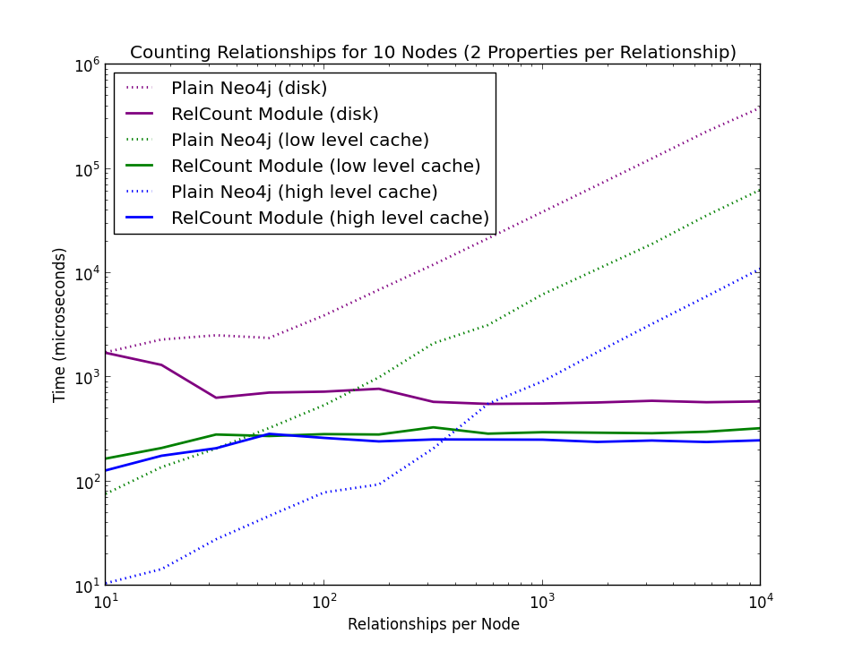
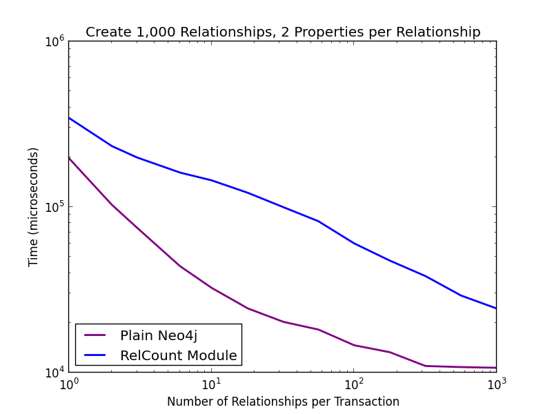
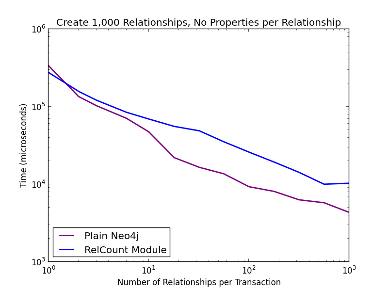
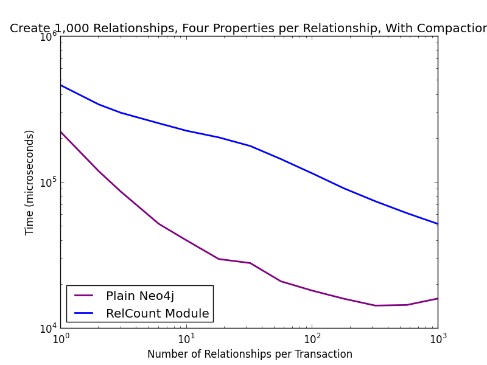
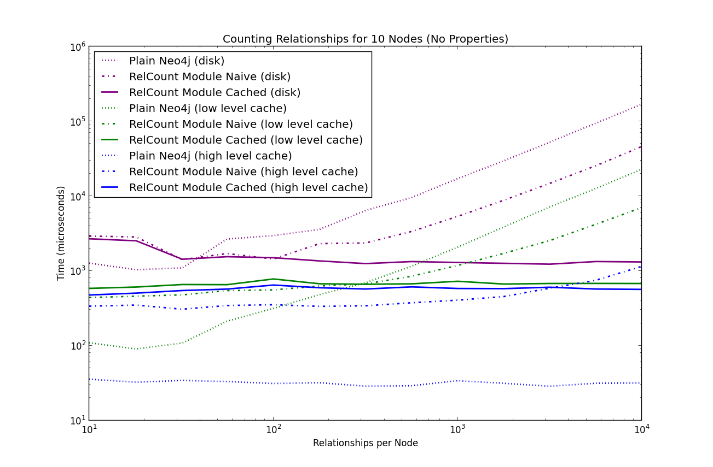
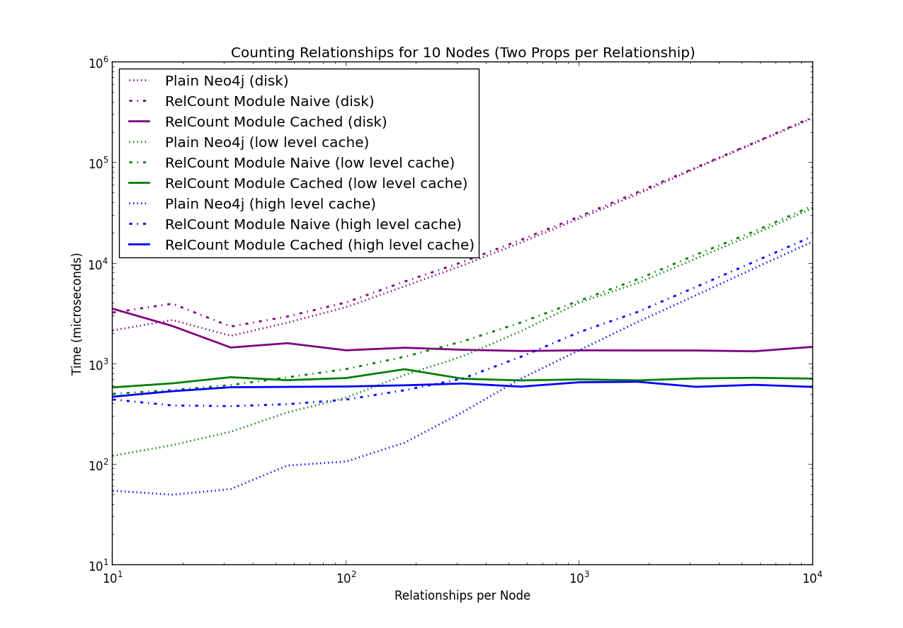

GraphAware Neo4j Relationship Counter
=====================================

[](https://travis-ci.org/graphaware/neo4j-relcount) | <a href="http://graphaware.com/downloads/" target="_blank">Downloads</a> | <a href="http://graphaware.com/site/relcount/latest/apidocs/" target="_blank">Javadoc</a> | Latest Release: 2.2.4.34.9

In some Neo4j applications, it is useful to know how many relationships of a given type, perhaps with different properties,
are present on a node. Naive on-demand relationship counting quickly becomes inefficient with large numbers of relationships
per node.

The aim of this [GraphAware](https://github.com/graphaware/neo4j-framework) Relationship Count Module is to provide an
easy-to-use, high-performance relationship counting mechanism. For more information on the motivation for this module
and a bit of maths around it, please refer to [Michal Bachman's MSc Thesis](http://graphaware.com/neo4j/analytics/2013/10/02/bachman-msc-thesis.html).

**Note:** Since the release of Neo4j 2.1 improves the relationship counting performance of the database significantly,
this module is less useful than before. However, it is still maintained as a reference implementation of GraphAware
[Transaction-Driven Runtime Module](https://github.com/graphaware/neo4j-framework/tree/tx-manager/runtime).

Getting the Software
--------------------

### Server Mode

When using Neo4j in the <a href="http://docs.neo4j.org/chunked/stable/server-installation.html" target="_blank">standalone server</a> mode,
you will need the <a href="https://github.com/graphaware/neo4j-framework" target="_blank">GraphAware Neo4j Framework</a> and GraphAware Neo4j RelCount .jar files (both of which you can <a href="http://graphaware.com/downloads/" target="_blank">download here</a>) dropped
into the `plugins` directory of your Neo4j installation.

Finally, add the following to your neo4j.properties:

```
com.graphaware.runtime.enabled=true
com.graphaware.module.relcount.1=com.graphaware.module.relcount.bootstrap.RelcountModuleBootstrapper

#optional configuration of threshold and relationships / relationship properties to take into account:
com.graphaware.module.relcount.threshold=10
com.graphaware.module.relcount.relationship=isType('R1')
com.graphaware.module.relcount.relationship.property=key != 'timestamp'
```

### Embedded Mode / Java Development

Java developers that use Neo4j in <a href="http://docs.neo4j.org/chunked/stable/tutorials-java-embedded.html" target="_blank">embedded mode</a>
and those developing Neo4j <a href="http://docs.neo4j.org/chunked/stable/server-plugins.html" target="_blank">server plugins</a>,
<a href="http://docs.neo4j.org/chunked/stable/server-unmanaged-extensions.html" target="_blank">unmanaged extensions</a>,
GraphAware Runtime Modules, or Spring MVC Controllers can include use the RelCount as a dependency for their Java project.

#### Releases

Releases are synced to <a href="http://search.maven.org/#search%7Cga%7C1%7Ca%3A%22relcount%22" target="_blank">Maven Central repository</a>. When using Maven for dependency management, include the following dependency in your pom.xml.

    <dependencies>
        ...
        <dependency>
            <groupId>com.graphaware</groupId>
            <artifactId>neo4j-relcount</artifactId>
            <version>2.2.4.34.9</version>
        </dependency>
        ...
    </dependencies>

#### Snapshots

To use the latest development version, just clone this repository, run `mvn clean install` and change the version in the
dependency above to 2.2.4.34.10-SNAPSHOT.

#### Note on Versioning Scheme

The version number has two parts, separated by a dash. The first part indicates compatibility with a Neo4j version.
 The second part is the version of the module. For example, version 2.1.3.10.3 is version 3 of the module
 compatible with GraphAware Framework 2.1.3.10 (and thus Neo4j 2.1.3).

Usage from Java
---------------

Once set up, it is very simple to use the API.

```java
Node node = ... //find a node somewhere, perhaps in an index

RelationshipCounter relationshipCounter = ... //instantiate some kind of relationship counter

relationshipCounter.count(node, wildcard(FOLLOWS, OUTGOING).with(STRENGTH, equalTo(1))); //DONE!
```

Relationship counters are capable of counting relationships based on their types, directions, and properties.

### Caching Relationship Counter

The most efficient counter is the `CachedRelationshipCounter`. As the name suggests, it counts relationships by
reading them from "cache", i.e. nodes' properties. In order for this caching mechanism to work, you need to be using the
[GraphAware Framework](https://github.com/graphaware/neo4j-framework) with [`RelationshipCountModule`](http://graphaware.com/site/relcount/latest/apidocs/com/graphaware/module/relcount/RelationshipCountModule.html) registered.

When using Neo4j in _embedded_ mode, the simplest default setup looks like this:

```java
GraphDatabaseService database = ... //impermanent or embedded database

GraphAwareRuntime runtime = GraphAwareRuntimeFactory.createRuntime(database);
RelationshipCountModule module = new RelationshipCountModule();
runtime.registerModule(module);
runtime.start();
```

Now, let's say you have a very simple graph with 10 people and 2 cities. Each person lives in one of the cities (relationship
type LIVES_IN), and each person follows every other person on Twitter (relationship type FOLLOWS). Furthermore, there
can be an optional "strength" property on each FOLLOWS relationship indicating the strength of a person's interest into
the other person (1 or 2).

In order to count all followers of a person named Tracy, who is represented by node with ID = 2 in Neo4j, you would write
the following:

```java
Node tracy = database.getNodeById(2);

//Wildcard means we don't care about properties:
RelationshipDescription followers = RelationshipDescriptionFactory.wildcard(FOLLOWS, INCOMING);

RelationshipCounter counter = new CachedRelationshipCounter(database);
counter.count(tracy, followers);
```

If you wanted to know, how many of those followers are very interested in Tracy (strength = 2):

```java
import static com.graphaware.description.predicate.Predicates.equalTo;
import static com.graphaware.description.relationship.RelationshipDescriptionFactory.wildcard;

//...

Node tracy = database.getNodeById(2);

RelationshipDescription followers = wildcard(FOLLOWS, INCOMING).with(STRENGTH, equalTo(2));

RelationshipCounter counter = new CachedRelationshipCounter(database);
counter.count(tracy, followers); //returns the count
```

When counting using `RelationshipDescriptionFactory.wildcard(FOLLOWS, INCOMING)`, all incoming relationships of type FOLLOWS are taken into
account, including those with and without the strength property. What if, however, the lack of the strength property has
some meaning, i.e. if we want to consider "undefined" as a separate case? This kind of counting is referred to as "literal"
counting and would be done like this:

```java
Node tracy = database.getNodeById(2);

//Literal means we properties not explicitly mentioned must be undefined:
RelationshipDescription followers = RelationshipDescriptionFactory.literal(FOLLOWS, INCOMING);

RelationshipCounter counter = new CachedRelationshipCounter(database);
counter.count(tracy, followers);
```

For graphs with thousands (or more) relationships per node, this way of counting relationships can be orders of
magnitude faster than a naive approach of traversing all relationships and inspecting their properties. See [performance](#performance)
for more details.

Usage in Server Mode
--------------------

REST API coming soon...

Note on Loops
-------------

We have taken the philosophy of counting loops (i.e., relationships of a node with itself) as 2 towards the total degree
of the node. This is different from the philosophy of Neo4j 2.1, which counts a loop as 1 towards the total degree.

How does it work?
-----------------

There is no magic. The module inspects all transactions before they are committed to the database and analyzes them for
any created, deleted, or modified relationships.

It caches the relationship counts for both incoming and outgoing relationships serialized as a property on each node.
In order not to pollute nodes too much, the cached information gets automatically compacted if needed.

Let's illustrate that on an example. Suppose that a node has no relationships to start with. When you create the first
outgoing relationship of type `FRIEND_OF` with properties `level` equal to `2` and `timestamp` equal to `1368206683579`,
the following information is automatically written to the node:

    FRIEND_OF,OUTGOING,level=2,timestamp=1368206683579 : 1x

At some point, after our node makes more friends, the situation will look something like this:

    FRIEND_OF,OUTGOING,level=2,timestamp=1368206683579 : 1x
    FRIEND_OF,OUTGOING,level=1,timestamp=1368206668364 : 1x
    FRIEND_OF,OUTGOING,level=2,timestamp=1368206623759 : 1x
    FRIEND_OF,OUTGOING,level=2,timestamp=1368924528927 : 1x
    FRIEND_OF,OUTGOING,level=0,timestamp=1368092348239 : 1x
    FRIEND_OF,OUTGOING,level=2,timestamp=1368547772839 : 1x
    FRIEND_OF,OUTGOING,level=1,timestamp=1368542321123 : 1x
    FRIEND_OF,OUTGOING,level=2,timestamp=1368254232452 : 1x
    FRIEND_OF,OUTGOING,level=1,timestamp=1368546532344 : 1x
    FRIEND_OF,OUTGOING,level=0,timestamp=1363234542345 : 1x
    FRIEND_OF,OUTGOING,level=0,timestamp=1363234555555 : 1x

At that point, the compactor looks at the situation finds out there are too many cached relationship counts. More specifically,
there is a threshold called the _compaction threshold_ which by default is set to 20. Let's illustrate with 10.

The compactor thus tries to generalize the cached relationships. One such generalization might involve replacing the
 timestamp with a wildcard, generating representations like this:

    FRIEND_OF,OUTGOING,level=0,timestamp=*
    FRIEND_OF,OUTGOING,level=1,timestamp=*
    FRIEND_OF,OUTGOING,level=2,timestamp=*

Then it compacts the cached relationship counts that match these representations. In our example, it results in this:

    FRIEND_OF,OUTGOING,level=0,timestamp=* : 3x
    FRIEND_OF,OUTGOING,level=1,timestamp=* : 3x
    FRIEND_OF,OUTGOING,level=2,timestamp=* : 5x

After that, timestamp will always be ignored for these relationships, so if the next created relationships is

    FRIEND_OF,OUTGOING,level=0,timestamp=1363266542345

it will result in

    FRIEND_OF,OUTGOING,level=0,timestamp=* : 4x
    FRIEND_OF,OUTGOING,level=1,timestamp=* : 3x
    FRIEND_OF,OUTGOING,level=2,timestamp=* : 5x

The compaction process uses heuristics to determine, which property is the best one to generalize. In simple terms,
it is the most property with most frequently changing values (measured per relationship type).

That's how it works on a high level. Of course relationships with different levels of generality are supported
(for example, creating a `FRIEND_OF` relationship without a level will work just fine). When issuing a query
 like this

```java
int count = counter.count(node, wildcard(FRIEND_OF, OUTGOING));
```

on a node with the following cache counts

    FRIEND_OF,OUTGOING,level=3,timestamp=1368206683579 : 1x
    FRIEND_OF,OUTGOING,level=2,timestamp=* : 10x
    FRIEND_OF,OUTGOING,level=1,timestamp=* : 20x
    FRIEND_OF,OUTGOING : 5x (no level or timestamp provided on these relationships)

the result will be... you guessed it... 36.

On the other hand, counting pure outgoing FRIEND_OF relationships with no properties would be done like this:

```java
int count = counter.count(node, literal(FRIEND_OF, OUTGOING));
```

and result in 5.

However, if you now issue the following query:
```java
int count = counter.count(node, literal(FRIEND_OF, OUTGOING)
    .with("level", equalTo(2))
    .with("timestamp", equalTo(12345)));
```
an `UnableToCountException` will be thrown, because the granularity needed for answering such query has been compacted
away. There are three ways to deal with this problem, either
* [configure the compaction threshold](#compaction) so that this doesn't happen, or
* [manually fallback to naive counting](#naive), using a `NaiveRelationshipCounter`, or
* [use `FallbackRelationshipCounter`](#fallback), which falls back to naive counting approach automatically

Advanced Usage
--------------

There are a number of things that can be tweaked here. Let's talk about the compaction threshold first.

<a name="compaction"/>
### Compaction Threshold Level

What should the compaction threshold be set to? That depends entirely on the use-case. Let's use the people/places example
from earlier with FOLLOWS and LIVES_IN relationships. Each node will have a number of LIVES_IN relationships, but only
incoming (places) or outgoing (people). These relationships have no properties, so that's 1 property for each node.

Furthermore, each person will have incoming and outgoing FOLLOWS relationships with 3 possible "strengths": none, 1, and 2.
That's 6 more properties. A compaction threshold of 7 would, therefore be appropriate for this use-case.

If you know, however, that you are not going to be interested in the strength of the FOLLOWS relationships, you could well
set the threshold to 3. One for the LIVES_IN relationships, and 2 for incoming and outgoing FOLLOWS relationships.

The threshold can be set when constructing the module by passing in a custom configuration:

```java
GraphAwareRuntime runtime = GraphAwareRuntimeFactory.createRuntime(database);

//threshold set to 7
RelationshipCountConfiguration config = RelationshipCountConfigurationImpl
    .defaultConfiguration()
    .with(new ThresholdBasedCompactionStrategy(7));

RelationshipCountModule module = new RelationshipCountModule(config);

runtime.registerModule(module);
runtime.start();
```

### Relationship Weights

Let's say you would like each relationship to have a different "weight", i.e. some relationships should count for more
than one. This is entirely possible by implementing a custom `RelationshipWeighingStrategy`.

Building on the previous example, let's say you would like the FOLLOWS relationship with strength = 2 to count for 2
 relationships. The following code would achieve just that:

```java
GraphAwareRuntime runtime = GraphAwareRuntimeFactory.createRuntime(database);

WeighingStrategy customWeighingStrategy = new WeighingStrategy() {
    @Override
    public int getRelationshipWeight(Relationship relationship, Node pointOfView) {
        return (int) relationship.getProperty(STRENGTH, 1);
    }
};

RelationshipCountConfiguration config = RelationshipCountConfigurationImpl.defaultConfiguration()
        .with(new ThresholdBasedCompactionStrategy(7))
        .with(customWeighingStrategy);

RelationshipCountModule module = new RelationshipCountModule(config);

runtime.registerModule(module);
runtime.start();
```

### Excluding Relationships

To exclude certain relationships from the count caching process altogether, create a policy that implements the
`RelationshipInclusionPolicy`. For example, if you're only interested in FOLLOWS relationship counts and nothing else,
you could configure the module as follows:

```java
GraphAwareRuntime runtime = GraphAwareRuntimeFactory.createRuntime(database);

RelationshipInclusionPolicy customRelationshipInclusionPolicy = new RelationshipInclusionPolicy.Adapter() {
    @Override
    public boolean include(Relationship relationship) {
        return relationship.isType(FOLLOWS);
    }
};

RelationshipCountConfiguration config = RelationshipCountConfigurationImpl.defaultConfiguration()
        .with(customRelationshipInclusionPolicy);

RelationshipCountModule module = new RelationshipCountModule(config);

runtime.registerModule(module);
runtime.start();
```

### Excluding Relationship Properties

Whilst the compaction mechanism eventually excludes frequently changing properties anyway, it might be useful (at least
for performance reasons) to exclude them explicitly, if you know up front that these properties are not going to be used
in the counting process.

Let's say, for example, that each FOLLOWS relationship has a "timestamp" property that is pretty much unique for each
relationship. In that case, you might choose to ignore that property for the purposes of relationship count caching by
setting up the module in the following fashion:

```java
 GraphAwareRuntime runtime = GraphAwareRuntimeFactory.createRuntime(database);

RelationshipPropertyInclusionPolicy propertyInclusionPolicy = new RelationshipPropertyInclusionPolicy() {
    @Override
    public boolean include(String key, Relationship propertyContainer) {
        return !"timestamp".equals(key);
    }
};

RelationshipCountConfiguration config = RelationshipCountConfigurationImpl.defaultConfiguration()
        .with(propertyInclusionPolicy);

RelationshipCountModule module = new RelationshipCountModule(config);

runtime.registerModule(module);
runtime.start();
```

<a name="naive"/>
### Naive Relationship Counter

It is possible to use the `RelationshipCounter` API without any caching at all. You might want to fall back to the
naive approach of traversing through all relationships because you caught an `UnableToCountException`, or maybe you
simply don't have enough relationships in your system to justify the write-overhead of the caching approach.

Please note that since Neo4j 2.1, the naive approach uses the optimised `Node.getDegree(...)` APIs.

Even when using the naive approach, it is possible to use custom strategies explained above.

The following snippet will count all Tracy's followers by traversing and inspecting all relationships:

```java
Node tracy = database.getNodeById(2);

RelationshipDescription followers = wildcard(FOLLOWS, INCOMING).with(STRENGTH, equalTo(2));

RelationshipCounter counter = new NaiveRelationshipCounter();
counter.count(tracy, followers); //returns the count
```

<a name="fallback"/>
### Fallback Relationship Counter

Although it is recommended to avoid getting `UnableToCountException`s by configuring things properly, there is an option
of an automatic fallback to the naive approach when the caching approach has failed, because the needed granularity for
counting some kind of relationship has been compacted away.

The following code snippet illustrates the usage:

```java
Node tracy = database.getNodeById(2);

RelationshipDescription followers = wildcard(FOLLOWS, INCOMING).with(STRENGTH, equalTo(2));

RelationshipCounter counter = new FallbackRelationshipCounter(database);
counter.count(tracy, followers); //returns the count
```

<a name="performance"/>
Performance (Neo4j 2.0 and below)
---------------------------------

Let's look at the benefit one can get from deploying this module. The following chart shows how long it takes (in microseconds)
to read relationship counts of 10 randomly selected nodes based on relationship type, direction, and two properties.
The x axis shows the average total number of relationships per node. There are 3 scenarios:
* no data in cache (reading from disk)
* data in low level cache (files in mapped memory)
* data in high level cache (objects on the heap)



As expected, the performance when reading relationship counts from cache is constant, whist the time taken to count
relationships by traversing them all increases linearly with the number of relationships. When data is read from disk,
it is always faster to use the module. When data is in low level cache, using the module pays off for nodes with more
than 50 relationships in total. Finally, for data in high level cache, using the module pays off for nodes with more than
350 relationships.

Using the module, counting relationships for nodes with 1,000 relationships is about 5x faster when data is in high level cache, 20x faster
when in low level cache, and 70x faster when on disk. For a node with 10,000 relationships and data on disk, using the
module makes relationship counting 700x faster.

The next figure shows the time taken to create 1,000 relationships between random pairs of nodes (100 nodes in the graph).
The penalty is between 30% and 70% of the write throughput (if all writes were just relationship creates), depending on how
the writes are batched together (x axis shows the number of created relationships in a single transaction).


When compaction takes place, the results can be even worse, so it is best to be avoided by proper configuration. Note, however,
that compaction only slows writes in the beginning; once the system reaches a "steady-state", it doesn't have any effect.
The next figure shows the same experiment as above, with 2 properties for every relationship, where one of the properties
is like a timestamp (changes all the time) and is thus eventually compacted out. These are the first 1,000 relationships,
thus worst case scenario. Up to 80% of the relationship creation write throughput is taken away by the module.



Performance (Neo4j 2.1 and above)
---------------------------------

When data is in high-level cache, counting relationships based on type and direction is a constant time operation in
Neo4j 2.1 and above. When properties need to be brought into the picture, each relationship still needs to be inspected.

The following charts present performance testing results on Neo4j 2.1.2:

#### Write Throughput

Not much has changed in terms of write throughput. It is clear that caching the relationship counts causes overhead:






#### Read Throughput (Counting Relationships)

It is apparent that when data is in high-level cache, plain Neo4j always performs better for counting relationships where
we don't care about property values. It is, indeed, a constant time operation.



However, for all other scenarios, i.e. when data is not in high-level cache, and/or we need to take into account relationship
 properties, there is a node degree above which GraphAware RelCount always performs better than pure Neo4j:



### License

Copyright (c) 2013 GraphAware

GraphAware is free software: you can redistribute it and/or modify it under the terms of the GNU General Public License
as published by the Free Software Foundation, either version 3 of the License, or (at your option) any later version.
This program is distributed in the hope that it will be useful, but WITHOUT ANY WARRANTY; without even the implied
warranty of MERCHANTABILITY or FITNESS FOR A PARTICULAR PURPOSE. See the GNU General Public License for more details.
You should have received a copy of the GNU General Public License along with this program.
If not, see <http://www.gnu.org/licenses/>.
